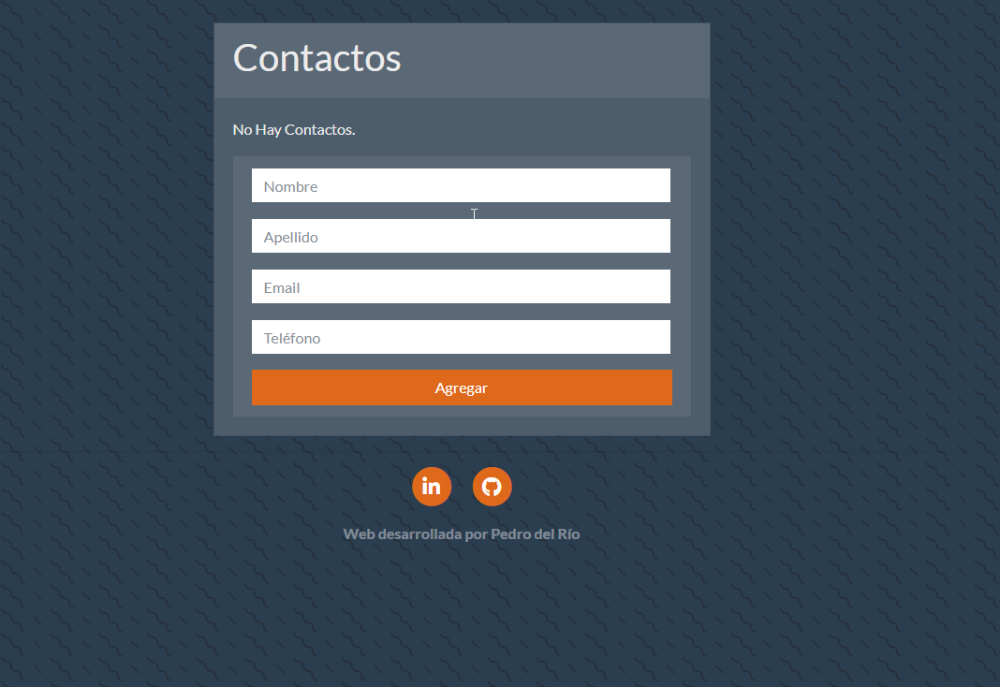

# Ejemplo de FIREBASE + NODEJS
## Objetivo 

Este es un ejemplo web para el aprendizaje y el desarrollo de como incorporar la base de datos Firebase en una web con una funcionalidad definida.

## Tecnologías usadas:

* BackEnd: NodeJS (potenciado con express)

* DataBase: Firebase

* Vistas: express-handlebars (para la creación de vistas dinamicas), Bootstrap 4 (Para el diseño responsivo)

## Imágenes

## Autores

* **Pedro del Río** - *Trabajo inicial* - [pedelriomarron](https://github.com/pedelriomarron)